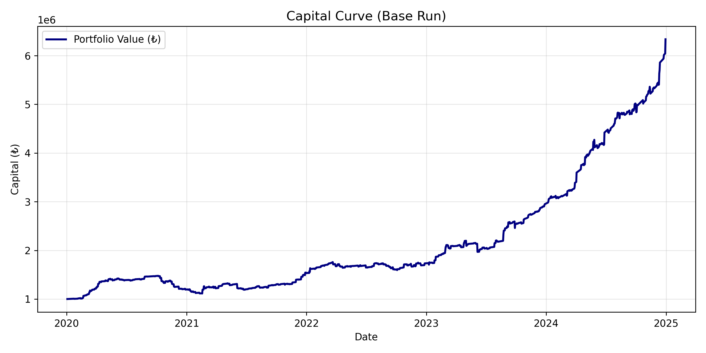
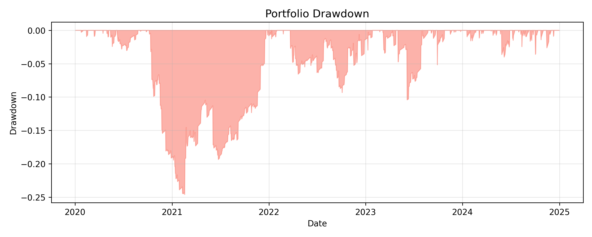
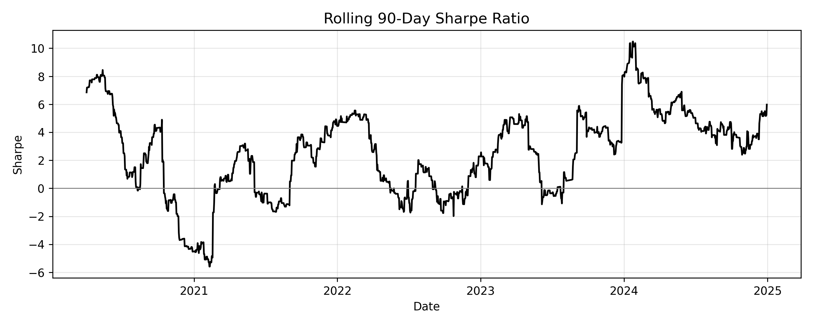
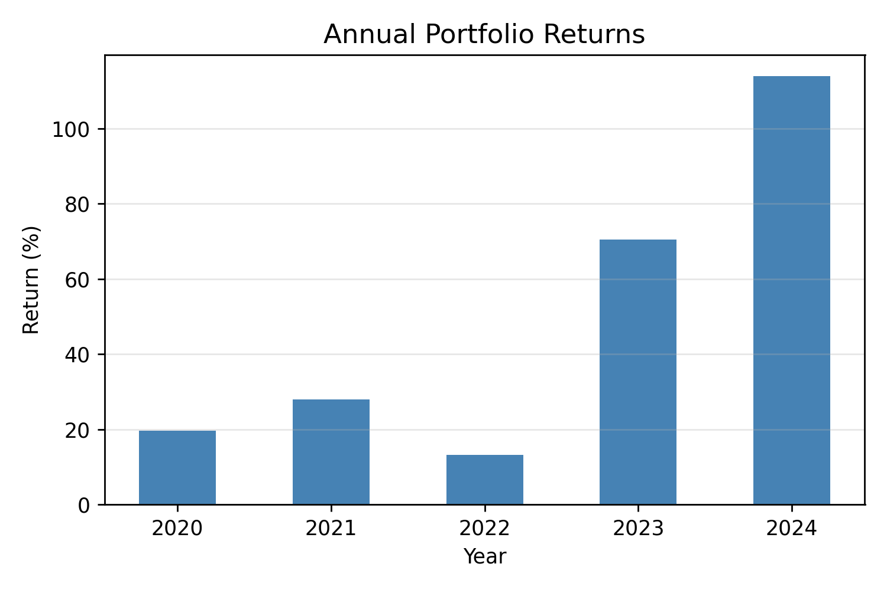

# Adaptive Spread Strategy: A Causal Framework for Equity Pair Trading

**Author:** Arman Erdogan  
**Backtest Period:** 2020–2024  
**Environment:** Python (pandas, numpy, matplotlib, scikit-learn, joblib)  
**Full Report:** [`Pair_Trade_Report.pdf`](Pair_Trade_Report.pdf)

---

## 🧠 Overview
A fully rule-based, causal, and adaptive **mean-reversion pair trading framework** for Borsa İstanbul equities.

The goal is to achieve repeatable alpha under realistic financing and execution constraints — **without predictive models or information leakage.**

> **Base Run (2020–2024)**  
> Initial capital ₺1M → ₺6.33M (×6.33 multiple)  
> **CAGR:** 44.7% **Sharpe:** 2.5 **Vol:** 15.2% **Max DD:** −24.6%

---

## ⚙️ Architecture

| Stage | Script | Description |
|-------|---------|-------------|
| Data fetch | `fetch_data_yahoo.py` | Downloads and stores 2016–2024 daily Borsa Istanbul data |
| Cleaning | `convert_to_daily.py` | Cleans OHLC data and saves as Parquet |
| Trade generation | `generate_all_trades.py` | Builds trades for all pairs (EntryZ ±1.5, ExitZ ±0.5) |
| Walk-forward | `walkforward_pair_selection.py` | Selects Top 25 pairs per year causally (2-year lookback) |

---

## 📊 Core Results

| Scenario       | End Cap (₺M) | CAGR (%) | Vol (%) | Sharpe | Sharpeα | Max DD (%) | Comment          |
|----------------|---------------|-----------|----------|---------|-----------|-------------|------------------|
| **base_run**   | 6.33          | 44.7      | 15.2     | 2.51    | 1.11      | −24.6       | Balanced profile |
| exit_tight     | 5.72          | 41.8      | 16.1     | 2.25    | 0.95      | −19.1       | Lower DD         |
| zscale_fixed   | 6.16          | 43.9      | 13.0     | 2.92    | 1.18      | −20.9       | Highest Sharpe   |
| zscale_wide    | 6.49          | 45.5      | 16.2     | 2.42    | 1.07      | −26.4       | Highest CAGR     |


---

## 📈 Key Visuals

| Metric | Chart |
|:-------|:------|
| Capital Growth |  |
| Drawdown |  |
| Rolling 90D Sharpe |  |
| Annual Returns |  |

---

## 🧩 Highlights

- **Causal:** all windows use lagged data (no lookahead)
- **Adaptive:** volatility maps to β and z-score window sizes
- **Walk-forward:** yearly pair selection prevents leakage
- **Realistic:** PB-style simulation (fees, borrow, margin, carry)
- **Transparent:** all trades and curves are reproducible

---

## 🧮 Reproduce Results

```bash
python fetch_data_yahoo.py
python convert_to_daily.py
python generate_all_trades.py
python walkforward_pair_selection.py
python batch_run_scenarios.py
python rebuild_run_comparison.py
python generate_core_plots.py


